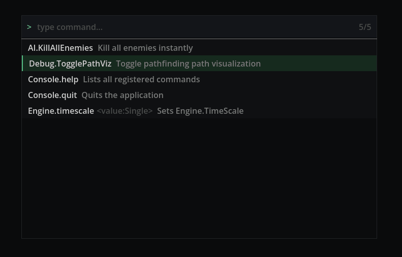

# Moonbreak Console

Developer console for Godot 4 C# (.NET 8). Floating modal overlay with fuzzy command search heavily inspired by Telescope for nvim.



## Installation

Add as a git submodule:

```
git submodule add https://github.com/PizzaCutter/moonbreak-console addons/moonbreak_console
```

Enable in Godot: **Project → Project Settings → Plugins → Moonbreak Console → Enable**.

## Usage

Press **backtick** (`` ` ``) to open. Type to fuzzy-search commands. Escape to close.

To override the backtick, define an action named `dev_console_toggle` in Godot's Input Map.

## Keyboard Shortcuts

| Key | Action |
|---|---|
| `` ` `` | Open / close console |
| `Escape` | Close console |
| `Enter` | Execute selected command (or autocomplete if params required) |
| `Tab` | Commit highlighted result into input bar |
| `Up` / `Down` | Move selection through results list |
| `Ctrl+Up` / `Ctrl+Down` | Cycle backwards / forwards through command history |
| `Ctrl+C` | Clear the input bar |

## Command Execution

Typing and pressing Enter on a command with no parameters executes it immediately.

For commands with parameters, the first Enter autocompletes `Category.Name ` into the input bar — type your arguments, then Enter again to execute:

```
> Engine.SetTimescale 0.5   ← Enter executes directly once params are present
```

## Command History

Executed commands are saved to `user://console_history.json` and restored across sessions (up to 100 entries). Consecutive duplicates are not stored. Use `Ctrl+Up` / `Ctrl+Down` to navigate. Navigating past the newest entry restores whatever you had typed before browsing.

## Fuzzy Search

Two match modes, sorted descending by score:

- **Substring match** — `kil` in `AI.KillAllEnemies` → score 1000+
- **Fuzzy non-contiguous** — `kle` matches `AI.KillAllEnemies` (k…l…e in order) → lower score

Results update on every keypress. Matched characters are highlighted in the results list. Search only applies to `Category.Name` — typing a space switches to parameter entry without affecting the results.

The counter in the top-right of the input bar shows `matched/total` commands.

## Registering Commands

Decorate any `static` method with `[ConsoleCommand]`. Any return type works — `void` produces no output, anything else is printed via `.ToString()`:

```csharp
using Moonbreak;

public static class Cheats
{
    [ConsoleCommand(Category = "AI", Description = "Kill all enemies instantly")]
    private static string KillAllEnemies()
    {
        GameManager.Instance.KillAllEnemies();
        return "All enemies killed";
    }

    [ConsoleCommand(Category = "Debug", Description = "Toggle god mode")]
    private static void ToggleGodMode() { ... }

    [ConsoleCommand(Category = "Debug", Description = "Get enemy count")]
    private static int GetEnemyCount() { return 5; }
}
```

No wiring needed. The registry scans all loaded assemblies at startup via reflection.

Methods can take parameters — parsed from console input by type:

```csharp
[ConsoleCommand(Category = "Engine", Description = "Set timescale")]
private static void SetTimescale(float value) { Engine.TimeScale = value; }
```

For runtime-dynamic commands, use the manual registration escape hatch:

```csharp
CommandRegistry.Register("mycommand", "Category", "Description", args => "output");
```

## Built-in Commands

| Command | Behavior |
|---|---|
| `help` | Lists all registered commands with descriptions |
| `clear` | Clears the log pane |
| `quit` | Quits the application |
| `timescale <float>` | Sets `Engine.TimeScale` |

## About

This project was built with heavy AI assistance (Claude) as a learning exercise in AI-collaborative development. The goal was figuring out how to work effectively with AI as a programming tool, not just using it as an autocomplete.

## Notes

- **Editor-time console** — runtime-only. Editor support needs `@tool`, `EditorInterface` viewport input, and a separate UI layer. `CanvasLayer` and `_Ready`-based scanning don't run in editor context.
- **History file location** — `user://` resolves to `%APPDATA%/Godot/app_userdata/<project_name>/` on Windows.
